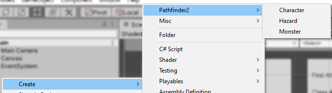
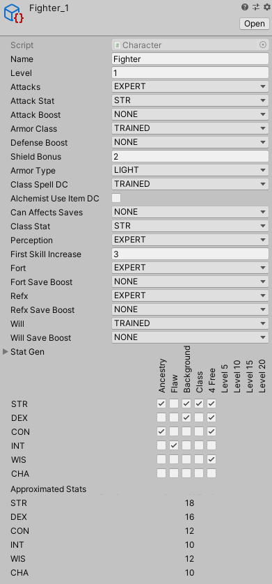

# PF2StatisticsData
Data visualization for the breakdown of success and failure for various classes and challenges in PF2

https://draco18s.itch.io/pf2stats

How to use:

1. Pick an encounter difficulty
2. Chose a class build and level from the dropdowns
3. Bars will display with the relative curve of success and failure across all d20 values
     - Black is a critical failure, blue is critical success, etc.
	 - Blended values indicate multiple possible outcomes (eg. critically hitting a LOW armor monster but only succeeding against a HIGH armor monster).
	 - The more green and blue the better

## Contributing monster, hazard, and class data

Unity uses a YAML format for asset files, it is not recommended to edit these directly as the contextual information will be missing.

Clone the repo, open in Unity 2019, open the Assets/Resources/ folder and right-click on either the monster, classes, or hazard folders and navigate to Create -> Pathfinder -> Character, Monster, or Hazard

Name the asset and then start editing it in the inspector.
Naming convention is the name of the class, monster, or hazard using underscores, then its level. So "Fighter_15" is a 15th level fighter.

I haven't done a lot of work to make the inspector look nice and have a good layout, opting for functional with the limited time I had available.
Fields:
 - Name: The name of the thing. For monsters and hazards this isn't used.
 - Weight: [Monsters and Hazards only] Not currently used, but weighted biasing is planned. For now, put `1`.
 - Level: The level of the thing. This is used to create appropriate matchups when analyzing the data.
 - Attack, Armor, Stealth, Perception, Saves, etc.: the UTEML or build guideline rating (TLMHE). Fighters are expert in Fort, the Poisoned Lock's poison save is Extreme.
     - Note that hazards have only Fort and Reflex save *attributes*, while their effect DC is the "Effect Difficulty Class".
 - Can Effect Saves: The type of saving throw this class/monster/hazard inflicts when it uses an ability that can do so (multiselectable).
 - Armor type: [class only] What type of armor this class wears. Pick the one with the *highest* TEML rating. If multiple, chose the one that will match the build's approximated DEX score.
 - Shield bonus: [class only] Whether or not an archetypal build of this class uses a shield and how much of an AC bonus is granted.
     - If non-zero the calculation is done for both shield raised and not raised.
 - First skill increase: [class only] `3` for all classes except Rogue (which is `2`)
 - X Save Boost: [class only] Covers things like Evasion where a success is treated as a critical success (multiselectable).
 - Stats: [class only] Priority approximation on where attribute boosts are spent. Flaws are not accounted for.
     - Key: Only one stat should be key, based on the class's key ability score. Classes that can choose (such as the rogue) should have separate archetypal builds. This stat will be maxed.
	 - Secondary, Tertiary: Only one stat each. These stats will be maxed, but lower than the Key score.
	 - Nice: Basically any other stat that the class *can* benefit from, even if minorly, such as Wisdom for Will saves, etc. One half of a boost will be spent each time boosts are available.
	 - Dump: Any stat the class literally doesn't care about. Will never be boosted.
 - Approximated stats: A Printout of the resulting values based on the settings selected. For specific monsters and hazards, get within +/-1.
 - Can be disabled: [hazard only] If the hazard doesn't have a disable DC, leave this unchecked.
 - Is complex: [hazard only] If the hazard is a complex hazard (exact numerical values differ between simple and complex traps).
 - Uses Attack/Uses Saving Throw: [hazard only] What kind of offensive ability the trap has. Summoning Rune uses neither, Poisoned Lock uses both.
 - Attacks are spells: [monster only] Used for spellcasters. Spellcaster monsters' attack rolls vs. AC use their casting stat (derived from their Ability DC).
 - Ability Save DC: [monster only] If abilities do not have a saving throw, this value is ignored, but set it to `NONE` anyway.
 